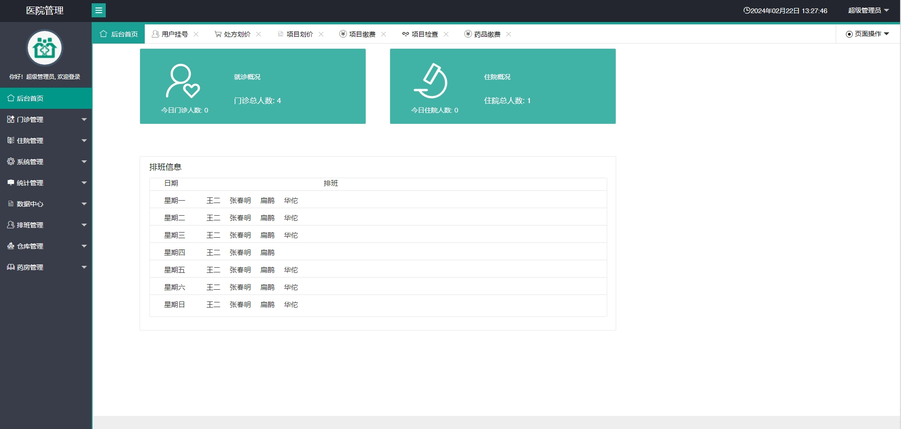
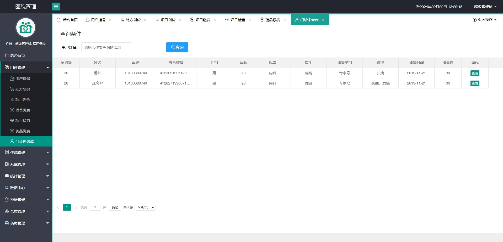
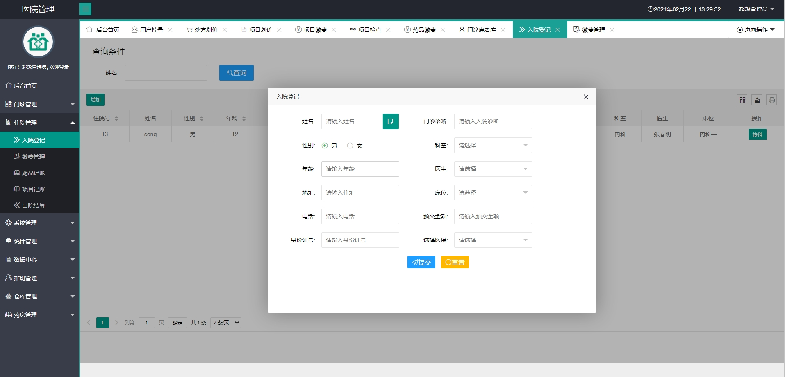
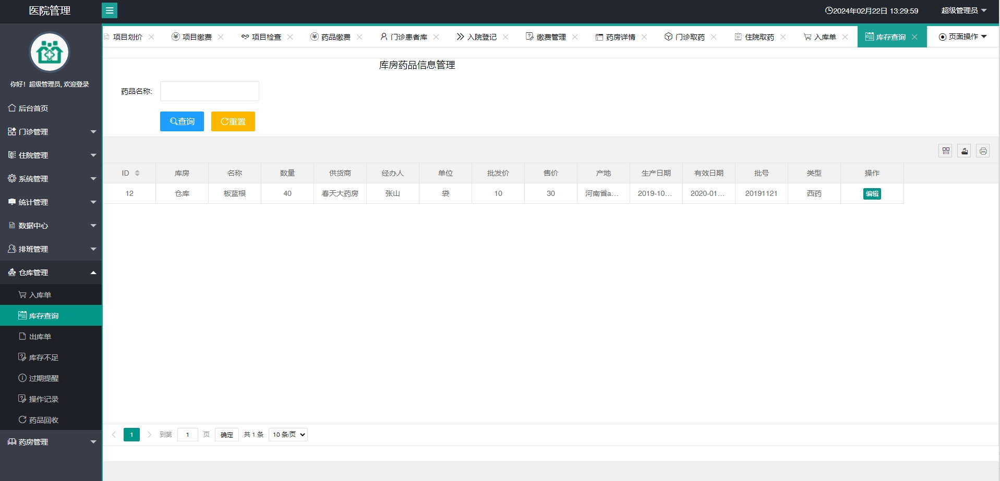

 **郑重声明：项目经过本地测试，确保可以运行， 可以用于学习和毕业设计参考~** 

**扫码 >> 源码商城 获取** 

#### 1.项目介绍
- 实现医院内部的挂号、收费、药房、药库、科室、病床的信息化管理。
- 提供记录医院内部各类经营决策汇总和明细的月报表、年报表。
- 记录用户住院信息、医生信息、科室，药品，手术，病床信息等。
- 药房管理，药房报缺。
- 库房管理，入库信息及经办人，查询剩余库存，出库单，药房报缺后，从库房调取。
- 技术和工具：SpringBoot+IDEA+jdk1.8+mysql5.7

→ → **提供项目文档、部署视频**

#### 2.本地部署
1.新建数据库his-sys
2.运行 sql脚本
3.用idea导入项目，并启动
4.启动后访问地址 localhost:8080
- 用户：admin
- 密码：123456
- 添加的新用户密码默认：123456

#### 3.项目部分截图

